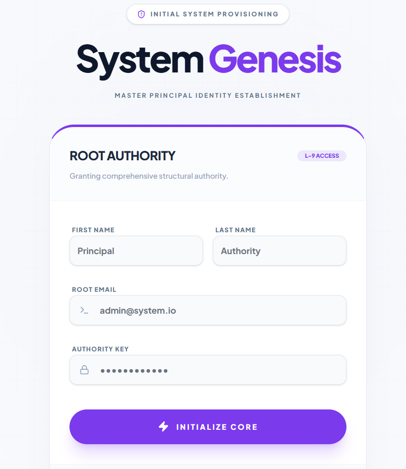
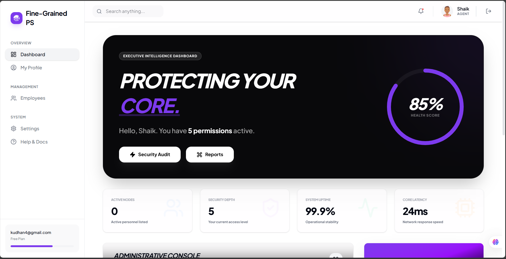
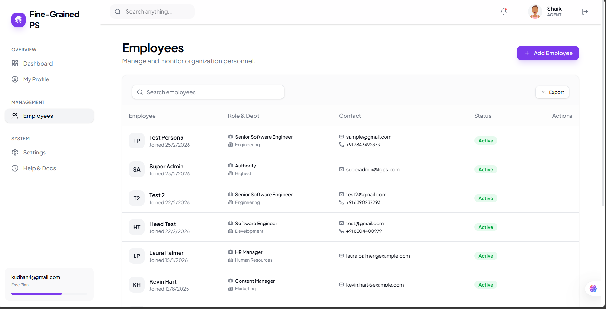
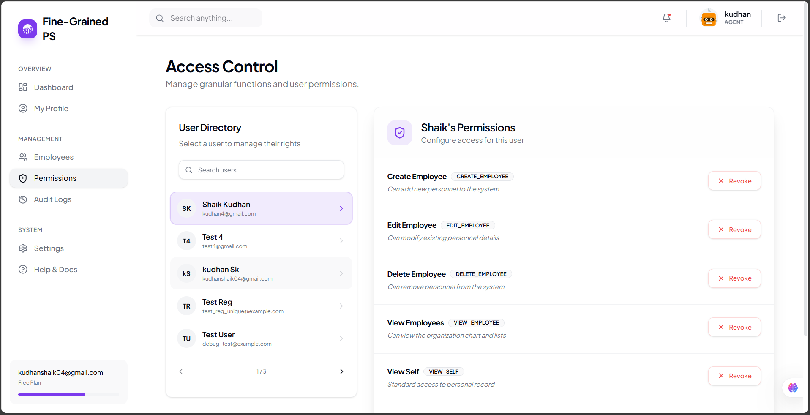
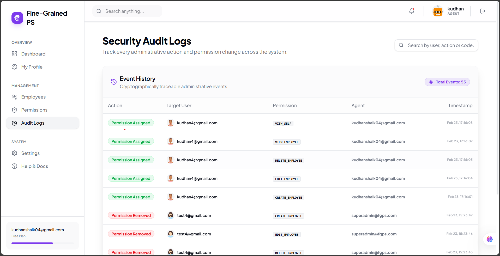
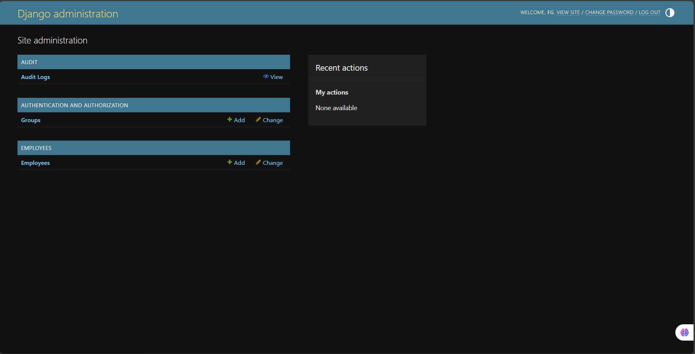

# 🛡️ Fine-Grained Permission System: Complete Evaluation Guide

Welcome to the **Fine-Grained Permission System**. This document serves as a comprehensive guide for developers, evaluators, and beginners to understand, set up, and explore every aspect of this application.

---

## 📖 Project Overview

This project is a high-security, role-agnostic **Fine-Grained Permission System**. Unlike traditional RBAC (Role-Based Access Control) which assigns permissions to roles, this system maps permissions (referred to as **Functions**) directly to **Users**.

It is designed to handle complex organizational structures where an individual might need specific access regardless of their "rank" or "department."

### Key Pillars:

1.  **Granular Authority**: Every action (Create, Edit, Delete, View) is a separate 'Function'.
2.  **Auditability**: Every permission change is logged chronologically in a forensic audit trail.
3.  **Genesis Protocol**: A built-in bootstrapping mechanism to initialize the system and first administrator.
4.  **Bento-Grid UI**: A modern, high-performance dashboard using the latest React ecosystem.

---

## 🛠️ Technology Stack

### Backend (The Authority Engine)

- **Framework**: [Django 5.2](https://www.djangoproject.com/)
- **API**: [Django REST Framework (DRF)](https://www.django-rest-framework.org/)
- **Authentication**: [SimpleJWT](https://django-rest-framework-simplejwt.readthedocs.io/) (Stateless Token-based)
- **Database**: SQLite (Ready for PostgreSQL migration)
- **Security**: Custom `HasPermission` middleware and forensic logging.

### Frontend (The Control Center)

- **Runtime**: [Vite](https://vitejs.dev/) + [React 19](https://react.dev/)
- **Styling**: [Tailwind CSS 4.0](https://tailwindcss.com/)
- **UI Components**: [Shadcn UI](https://ui.shadcn.com/) (Radix Primitives)
- **State Management**: [Zustand](https://github.com/pmndrs/zustand) (Super-fast, minimal)
- **Icons**: [Lucide React](https://lucide.dev/)
- **Animations**: [Framer Motion](https://www.framer.com/motion/)

---

## 📂 Project Structure

```text
fine-grained-permission-system/
├── backend/                  # Django REST API
│   ├── apps/
│   │   ├── accounts/         # User management & Auth
│   │   ├── employees/        # Employee data (Permission-gated)
│   │   ├── permissions/      # The Permission Logic & Models
│   │   └── audit/            # Action tracking & Logs
│   └── config/               # Project settings & URLs
├── frontend/                 # React SPA
│   ├── src/
│   │   ├── api/              # Axios instance & interceptors
│   │   ├── components/       # Reusable UI (Button, Input, etc.)
│   │   ├── hooks/            # useAuthStore & usePermissions
│   │   └── pages/            # View logic (Dashboard, Profile, etc.)
└── ...                       # Root documentation & workflow files
```

---

## 🚀 Quick Start Guide (For Beginners)

### 1. Prerequisites

- Python 3.10+ installed.
- Node.js 18+ installed.

### 2. Backend Setup

```bash
cd backend
# Create virtual environment
python -m venv venv
# Activate it (Windows)
.\venv\Scripts\activate

# Install dependencies
pip install -r requirements.txt

# Run migrations
python manage.py migrate

# Start the server
python manage.py runserver
```

### 3. Frontend Setup

```bash
cd frontend
# Install dependencies
npm install

# Start development server
npm run dev
```

---

## 🔑 The Genesis Protocol (Bootstrapping)

Because this is a permission-gated system, you cannot do anything without an account that has `ASSIGN_PERMISSION`.

1.  Open your browser to `http://localhost:5173/genesis`.
2.  Fill in the form to create the **Master Administrator**.
3.  This protocol can only be run **ONCE**. After the first admin is created, this endpoint locks automatically.
4.  Once created, log in via `http://localhost:5173/login`.



---

## 📡 API Documentation Summary

The backend exposes a clean RESTful interface. All secured endpoints require an `Authorization: Bearer <token>` header.

### Authentication

- `POST /auth/login/`: Get JWT access/refresh tokens.
- `POST /auth/register/`: Register a new user (Wait-list status).
- `GET /auth/me/`: Get current logged-in user profile.
- `POST /auth/genesis/`: Bootstrap the system.

### Permissions

- `POST /permissions/assign/`: Give specific functions to a user.
- `POST /permissions/remove/`: Revoke functions from a user.
- `GET /auth/users/`: List users for permission management.

### Employee Management (Gated by Functions)

- `GET /employees/`: List all employees.
- `POST /employees/`: Create new employee.
- `GET /employees/<id>/`: View specific employee.
- `PATCH /employees/<id>/`: Edit employee details.
- `DELETE /employees/<id>/`: Remove employee.

### Audit

- `GET /audit/logs/`: View the history of permission changes.

---

## 🖥️ Frontend Page Walkthrough

1.  **Dashboard**: The command center. Displays quick stats and recent activity.
    
2.  **Employee Directory**: Table view of all personnel with search and sorting.
    
3.  **Permission Management**: A specialized UI for admins to toggle granular rights for any user in real-time.
    
4.  **Audit Logs**: A timestamped list of administrative actions for security compliance.
    
5.  **Profile & Settings**: Manage your own identity, avatar seed, and password.

---

## 🧪 Evaluation Checklist (Try these!)

To truly test the power of this system, follow these steps:

1.  **Check Empty State**: Register a new user (`user@test.com`). Log in. Notice you can't see the Employee list or use the Dashboard fully.
2.  **Grant Access**: Log in as the **Master Admin**. Go to **Permission Management**. Find `user@test.com` and grant them `VIEW_EMPLOYEE` and `CREATE_EMPLOYEE`.
3.  **Verify Propagation**: Log back in as `user@test.com`. Notice the Employee menu item suddenly appears, and you can now add new employees.
4.  **Audit the Action**: Go back to the **Audit Logs** as Admin. You will see a record: _"Admin assigned VIEW_EMPLOYEE to user@test.com"_ with a precise timestamp.

---

---

## 🏛️ Backend Architecture Deep-Dive

The backend is engineered for **Atomic Access Control**, moving beyond binary roles to function-level granularity.

### 🧩 Core Applications (`/backend/apps/`)

- **`accounts`**: Custom User model using email as ID. Integrates with DiceBear for biometric avatars.
- **`permissions`**: The logic engine. Defines `Function` models and the `HasPermission` DRF class.
- **`employees`**: The main business domain. Every CRUD action is gated by a specific permission code.
- **`audit`**: Forensic tracing. Records every permission change with `performed_by` and `target_user` context.
- **`core`**: Shared infrastructure for standardized API responses.



### 🛡️ Security Enforcement

The `HasPermission` class check follows this priority:

1. **Superuser Override**: `is_superuser` bypasses all checks.
2. **Explicit Grant**: Checks the `user.functions` join table for the specific code required by the view.

### 🧬 The Request Life Cycle

1. **Extraction**: SimpleJWT extracts the `Bearer` token from the request header.
2. **Validation**: Token signature is verified; `request.user` is populated.
3. **Routing**: Django routes to the specific View (e.g., `EmployeeViewSet`).
4. **Permission Logic**: `HasPermission` queries the database for the required code.
5. **Execution**: If authorized, data is processed via Serializers; Audit Logs are generated for sensitive changes.
6. **Delivery**: Data is wrapped in the `api_response` format and delivered as JSON.

---

## 🎨 Frontend UI & Logic Deep-Dive

### ⚡ Technical Foundation

- **State**: [Zustand](https://github.com/pmndrs/zustand) for persistent, ultra-fast auth state.
- **API**: Axios with **Interceptors** for silent JWT rotation (refreshing tokens automatically on 401).
- **Style**: High-contrast "Executive" design using Tailwind CSS 4.0 and Framer Motion for micro-interactions.

### 🧠 Identity-Aware UI

The frontend doesn't just block pages; it hides individual UI nodes. Using the `hasPermission('CODE')` helper from the auth store, the UI adapts in real-time to the user's authority level.

### 🎨 UI Design Language

- **Industrial Palette**: Centered on "Slate" and "Primary" blue for a high-authority feel.
- **Bento Geometry**: Large cards with rounded corners (`rounded-[2rem]`) to organize dense security data.
- **Micro-Animations**: Extensive use of `framer-motion` for smooth layout transitions and hover effects.
- **Biometric Identity**: Integration with DiceBear API to generate unique visual seeds for every user.

---

## 🔄 System Workflows & Logic Flows

### 1. The "Zero-Trust" New User Journey

- **Registration**: Creates a user with `[]` permissions.
- **Login**: User sees a "Restricted Access" dashboard until an admin provisions them.

### 2. The Provisioning Loop

- **Admin Action**: An admin uses the "Access Control" page to grant a permission.
- **Atomic Transaction**: The permission is granted, and an Audit Log is saved simultaneously.
- **Instant Refresh**: The target user's UI updates on their next action or session refresh.

### 3. The "Invisible" API Shield

When an Access Token expires:

1. `apiClient` catches the `401`.
2. It silently hits `/auth/refresh/`.
3. If valid, the original request is **retried** with the new token.
4. The user experiences zero interruption.

### 4. Deployment & Cloud Readiness

- **Database Agnostic**: Uses `dj-database-url` to handle SQLite in dev and PostgreSQL in production automatically.
- **Static Asset Shield**: Uses `WhiteNoise` for efficient serving of frontend build assets in cloud environments.
- **CORS Management**: Pre-configured with restricted CORS headers to ensure backend security.

---

**Built with Precision. Designed for Security.**
_&copy; 2026 Fine-Grained Permission System_
